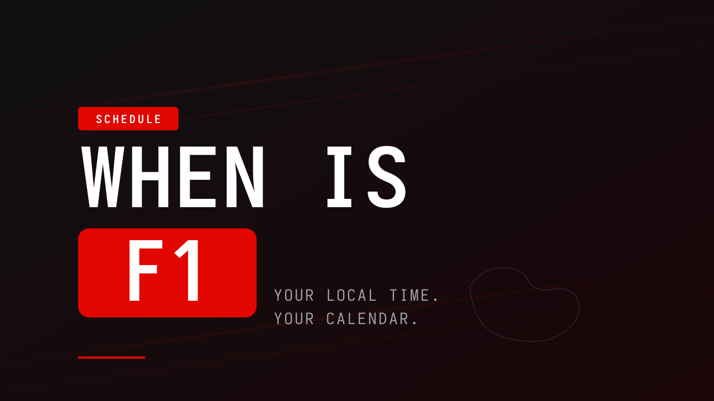

<p align="center">
  
</p>

# When Is F1

A small static site that shows upcoming Formula 1 sessions in your local time and lets you add them to your calendar.

- See every session of every remaining round of the current season.
- Pick your country (searchable, with flag icons) — times convert automatically.
- Each session is shown both in the circuit's local time and in yours.
- **Pinned "next session" hero** with a live countdown, and a **LIVE** badge when a session is running.
- **Bilingual UI (English / French)** with a language switch; session labels, dates and number formats follow the chosen language.
- **Championship standings** (drivers + constructors), **last-race result** (podium, pole, fastest lap), and **title math** ("still in contention / can clinch this round").
- **Circuit facts** (length, laps, lap record) and a **race-weekend weather forecast** (Open-Meteo) per round.
- **Recent winners** at each circuit, loaded on demand.
- **Live timing** during a session (leaderboard, gaps, track status flag, track weather, team radio) via OpenF1 — degrades gracefully when nothing is live.
- Search/filter rounds, **favorites** (pin to top + filter), **follow a driver or team**, **race-only vs full-weekend** view, and a **season selector** (past seasons too).
- One-click add to Google Calendar, or download an `.ics` for the race or the full weekend — with **calendar reminders (VALARM)** baked in and a configurable default.
- **Reminders** via the Notification API (Notification Triggers where supported, with a tab-open fallback).
- **Shareable deep links** (`?round=N`), URL-encoded state, and an **embeddable mode** (`?embed=1`).
- Light / dark theme, responsive layout, accessible (skip link, keyboard, `prefers-reduced-motion`, `forced-colors`, RTL-ready), no build step.
- Installable as a PWA — works offline after the first visit, with an "update available" prompt instead of a silent swap.
- An **auto-updating calendar feed** (`season.ics`) regenerated daily by CI (see `.github/workflows/season-ics.yml`).
- **External services per round** (all key-less): circuit **map** + **directions** (OpenStreetMap / Google Maps), **highlights** (YouTube), **discussion** (Reddit r/formula1), **trip planning** (flights / Booking / Airbnb with the weekend's dates pre-filled), and a **Wikipedia** circuit summary with thumbnail.
- **More calendar targets**: Google, Outlook, `.ics`, and a `webcal://` **subscription** to the season feed.
- **Country auto-detect** refined by IP (ipwho.is), falling back to timezone detection.
- Optional **Discord reminders** — paste an incoming-webhook URL in Settings and send a race to your server with one tap.
- Optional, **cookie-free analytics** (GoatCounter / Plausible / Umami) — a ready-to-enable snippet in `index.html` (off by default; add your own site ID).

## Run locally

No dependencies, no bundler. Any static server works:

```sh
python -m http.server 8000
```

Then open http://localhost:8000.

Opening `index.html` directly via `file://` will not work — the app uses ES modules and `fetch`, both of which require an HTTP origin.

## Install as an Android / iOS app

The site is a PWA. To install it on your phone:

1. Host it over HTTPS. The simplest option is GitHub Pages — in the repo settings, **Settings → Pages → Source: deploy from branch → `main` / `(root)`**. The site will be served at `https://<user>.github.io/when_is_f1/`.
2. Open that URL in Chrome (Android) or Safari (iOS).
3. **Android**: Chrome will prompt "Install app", or use the menu → "Install app" / "Add to Home Screen". The app appears with its own icon and runs full-screen.
4. **iOS**: Share menu → "Add to Home Screen". Same outcome.

A service worker (`sw.js`) precaches the app shell and stores the schedule response, so the app works offline after the first visit.

If you later want a real APK in the Play Store, wrap this same hosted PWA with [Bubblewrap](https://github.com/GoogleChromeLabs/bubblewrap) (Trusted Web Activity).

## Stack

- Vanilla HTML, CSS, ES modules. No framework, no build.
- F1 schedule from [Jolpica F1](https://api.jolpi.ca/) (a free, key-less Ergast successor).
- Country / IANA timezone data inlined from [`countries-and-timezones`](https://github.com/manuelmhtr/countries-and-timezones) (MIT).
- Flag SVGs from [`flag-icons`](https://github.com/lipis/flag-icons) (MIT).
- Track-layout SVGs from Wikimedia Commons (see [ATTRIBUTION.md](ATTRIBUTION.md)).
- Typeface: [Space Mono](https://fonts.google.com/specimen/Space+Mono) (SIL OFL 1.1).

## Layout

```
index.html              # entry
styles.css              # all styles, light + dark via CSS variables
app.js                  # wires the pieces together
lib/
  api.js                # fetch + normalize Jolpica response
  format.js             # Intl-based date / time / relative formatting
  ics.js                # RFC 5545 .ics builder + Blob download
  gcal.js               # Google Calendar URL builder
  theme.js              # light/dark toggle, persisted in localStorage
  combobox.js           # custom searchable country picker with SVG flags
data/
  countries.js          # ISO-2 -> display name (247 entries)
  country-timezones.js  # ISO-2 -> [IANA zones], plus zone -> primary country
  circuit-timezones.js  # F1 circuitId -> IANA zone
assets/
  flags/                # 247 SVG country flags
  circuits/             # 21 SVG track maps
ATTRIBUTION.md
```

## Limitations

- iOS Safari does not reliably download `.ics` files from Blob URLs, so on iOS the `.ics` option is hidden and only the Google Calendar link is shown. Working around this would need a server.
- Madring (Madrid, round 14 of 2026) does not have a track-layout SVG on Wikimedia Commons yet — the card shows a "Map coming soon" placeholder.
- **Reminders** are static-only. Where the browser supports Notification Triggers (Chromium) they fire even with the tab closed; otherwise they fire only while the tab is open. **True Web Push** (server-sent, browser fully closed) is intentionally out of scope — it requires VAPID keys, a push server and a subscription store. The auto-updating `season.ics` calendar feed is the recommended "set & forget" alternative.
- **Live timing** (OpenF1) and **weather** (Open-Meteo) are fetched live and never cached by the service worker, so they degrade to a quiet "unavailable" line when offline or off-session.
- The auto-updating `season.ics` is the one feature that needs CI (a scheduled GitHub Action) — the app runtime itself stays fully static.
